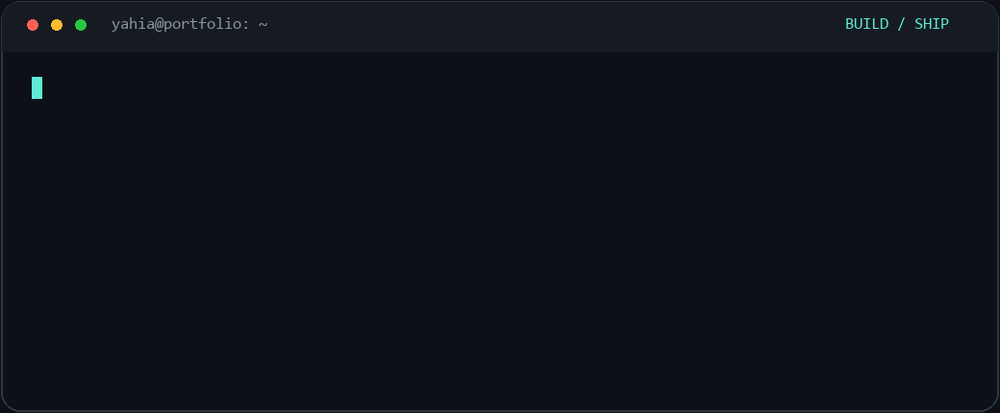

<h1>Hi, I'm Yahia! </h1>

<strong>Software Engineer</strong>

<strong>Frontend · Backend · DevOps · Mobile</strong>

I’m a software engineer with strong expertise across <strong>frontend, backend, and DevOps</strong>. I turn product ideas into polished interfaces, reliable APIs, and production deployments—with quality and attention to detail throughout.

<strong>Next.js · React · TypeScript</strong> Node.js · Express · Laravel · Payload CMS Docker · GitHub Actions · Linux VPS · DigitalOcean

  
  
  
  
  

  <a href="#-featured-work">Featured work</a> ·
  <a href="#-experience">Experience</a> ·
  <a href="#-stack">Stack</a> ·
  <a href="https://www.yahiaelsayed.com/about">More about me</a>

---

## 🚀 At a Glance

- **Current role:** Software Engineer at **Pimula Agency**, Alexandria, Egypt.
- **Frontend:** Next.js, React, and TypeScript—responsive interfaces, reusable components, performance, and accessibility.
- **Backend:** Node.js, Express, Laravel, Payload CMS, and PostgreSQL—API development, integrations, and data-backed applications.
- **DevOps:** Docker, Docker Compose, GitHub Actions, Linux VPS servers, Caddy, and DigitalOcean—automated pipelines and production deployments.
- **Engineering approach:** Own features from design to release, with attention to maintainability, reliable behavior, and the details users notice.
- **Background:** Computer Science graduate, class of 2024. Outside code, I enjoy music production and composing.

## ✨ Featured Work

Selected projects across full-stack architecture, frontend development, and product interfaces.

### 🛍️ [Ventra Marketplace](https://www.yahiaelsayed.com/projects/ventra-marketplace)

**Full-stack engineering** · Software Engineer · MVP build, May–Jun 2026

A multivendor commerce platform connecting customers, sellers, and platform operators.

**Stack:** **Next.js**, React, TypeScript, Laravel, Filament, TanStack Query, Zustand, Stripe

- **Three connected experiences:** customer storefront, seller workspace, and an operations admin panel.
- **Commerce workflows:** vendor-specific orders, stock validation, Stripe webhooks, and Cash on Delivery reconciliation.
- **Beyond checkout:** shipment tracking, returns, refund holds, and vendor accounting.

[View live demo ↗](https://ventra.yahiaelsayed.com/) · [Architecture & case study →](https://www.yahiaelsayed.com/projects/ventra-marketplace)

---

### 🎨 [Kijamii](https://www.yahiaelsayed.com/projects/kijamii)

**Frontend & motion** · Software Engineer

A marketing agency portfolio combining a polished Next.js frontend with interactive animation.

**Stack:** **Next.js**, TypeScript, Tailwind CSS, Shadcn UI, GSAP

- **Frontend implementation:** responsive pages and interfaces built with Next.js and TypeScript.
- **Motion and presentation:** GSAP animations that bring the agency’s work and capabilities into view.

[View live website ↗](https://kijamii.com/) · [Project case study →](https://www.yahiaelsayed.com/projects/kijamii)

---

### 💼 [JobSolv](https://www.yahiaelsayed.com/projects/jobsolv)

**Product frontend** · Frontend Developer

A job-search application with AI-powered resume tools and automated application features.

**Stack:** **React**, TypeScript, Tailwind CSS, Shadcn UI

- **Product UI:** React frontend implementation for a job-search platform.
- **Interface toolkit:** TypeScript, Tailwind CSS, and Shadcn UI for the application’s screens and components.

[View live app ↗](https://app.jobsolv.com/) · [Project case study →](https://www.yahiaelsayed.com/projects/jobsolv)

<a href="https://www.yahiaelsayed.com/projects"><strong>Explore the full project archive →</strong></a>

---

## 💼 Experience

### Software Engineer · Pimula Agency
**Apr 2024 – Present**

- Build and maintain React and Next.js applications, owning features from initial setup to release.
- Collaborate with designers on reusable components, polished interactions, and responsive interfaces.
- Optimize rendering, assets, and network requests, and integrate RESTful APIs.
- Build and maintain backend services, Payload CMS integrations, and PostgreSQL databases.
- Deploy and maintain applications using Docker, GitHub Actions, CI/CD pipelines, Linux, Caddy, and DigitalOcean.

### Front-End Developer · NextGen Software
**Jan 2024 – Apr 2024**

- Built responsive React and Next.js interfaces and reusable UI patterns.
- Improved loading and interaction performance.
- Integrated REST APIs with clear loading and error states.

### Full Stack Developer Intern · Information Technology Institute (ITI)
**Jun 2023 – Sep 2023**

- Contributed to React and Node.js applications, RESTful APIs, and responsive layouts.
- Worked on debugging and performance improvements across frontend and backend features.

### Cognos Analytics Intern · IBM
**Jul 2022 – Dec 2022**

- Built dashboards and reports with Cognos Analytics.
- Worked on data models and visualizations with analysts to meet stakeholder needs.

---

## 🛠️ Stack

### Frontend

### Backend & Data

### DevOps & Infrastructure

### Mobile

### Cloud Services & Hosting

### Languages

### Design Tools

### Workspace Setup

## 📈 GitHub Stats

    
     
     
     
    
     
      
    
     
      
    
     
      
    

---

  <strong>Have a Next.js product or website in mind?</strong> 
  <a href="https://www.yahiaelsayed.com/contact">Let's talk</a> ·
  <a href="https://www.yahiaelsayed.com">Explore my portfolio</a>

